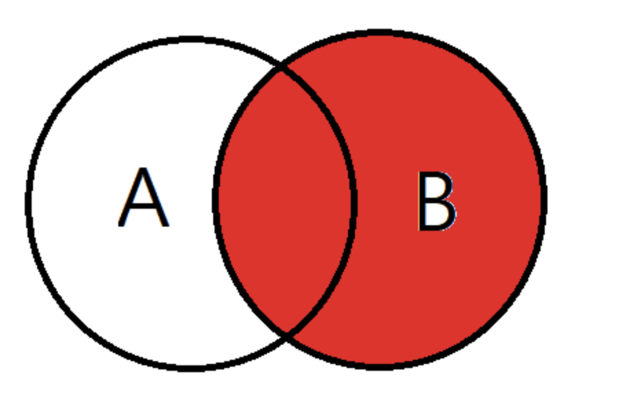
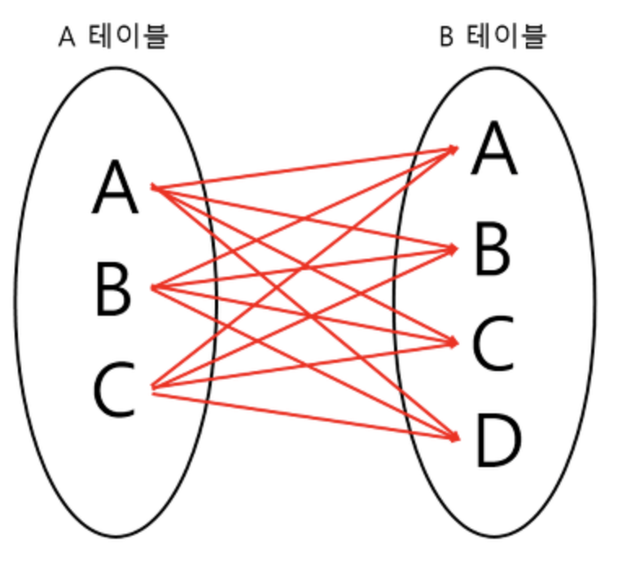

# Database

 

 

 

#### 트랜잭션이란 무엇인가요?

> 트랜잭션(Transaction)은 데이터베이스의 상태를 변환시키는 하나의 논리적 기능을 수행하기 위한 작업의 단위 또는 한꺼번에 모두 수행되어야 할 일련의 연산들을 의미합니다. 하나의 트랜잭션이 성공적으로 완료되면 Commit 되고, 실패하면 Rollback 됩니다.
>
> 트랜잭션의 성질은 ACID(Atomic, Consistency, Isolation, Durability) 입니다.
>
> 원자성(Atomic)은 트랜잭션의 연산이 데이터베이스에 모두 반영되든지 아니면 전혀 반영되지 않아야 한다는 것입니다.
>
> 일관성(Consistency)은 트랜잭션이 실행을 성공적으로 완료하면 언제나 일관성 있는 데이터베이스 상태로 유지하는 것을 의미합니다. 예를들어, A가 B에게 10원씩 두 번 송금했는데 B에게 입금이 안되거나 한번밖에 안되는 등의 데이터 불일치가 생겨선 안된다는 것입니다.
>
> 고립성(Isolation)은 트랜잭션을 수행 시 다른 트랜잭션의 연산 작업이 끼어들지 못하도록 보장하는 것을 의미합니다. 대표적인 고립 수준은 4가지(Read Uncommitted, Read Committed, Repeatable Read, Serializable Read)가 있고 고립성 수준이 높을수록 동시성은 떨어집니다.
>
> 지속성(Durability)은 성공적으로 수행된 트랜잭션은 다른 트랜잭션에 의해 변경되기 전까진 장애가 발생해도 변하지 않아야 함을 의미합니다.
>
> 트랜잭션의 연산은 Commit과 Rollback 연산이 있습니다.
>
>  Commit 연산은 한개의 논리적 단위(트랜잭션)에 대한 작업이 성공적으로 끝났고 데이터베이스가 다시 일관된 상태에 있을 때, 이 트랜잭션이 행한 갱신 연산이 완료된 것을 트랜잭션 관리자에게 알려주는 연산입니다.
>
> Rollback 연산은하나의 트랜잭션 처리가 비정상적으로 종료되어 데이터베이스의 일관성을 깨뜨렸을 때, 이 트랜잭션의 일부가 정상적으로 처리되었더라도 트랜잭션의 원자성을 구현하기 위해 이 트랜잭션이 행한 모든 연산을 취소(Undo)하는 연산입니다. Rollback시에는 해당 트랜잭션을 재시작하거나 폐기합니다.

 

 

 

#### 정규화에 대해 설명해주세요.

 

 

 

#### index에 대해 설명해주세요.

> 인덱스는 DBMS에서 데이터의 처리(Create, Update, Delete) 성능을 희생하고, 그대신 데이터의 읽기 성능을 높이는 기능입니다. TABLE의 컬럼을 색인화(따로 파일로 저장)하여 검색시 해당 TABLE의 레코드를 full scan 하는게 아니라 색인화 되어있는 INDEX 파일을 검색하여 검색속도를 빠르게 합니다.
>
> 만약 한개의 컬럼에 인덱스를 걸어야 한다면, 해당 컬럼은 카디널리티가 가장 높은 것을 잡아야합니다. 인덱스로 효율을 높히려면 해당 인덱스로 많은 부분을 걸러내야 하기 때문입니다.
>
> > 카디널리티(Cardinality)란 해당 컬럼의 **중복된 수치**를 나타냅니다.
> > 예를 들어 성별, 학년 등은 카디널리티가 낮다고 얘기합니다.
> > 반대로 주민등록번호, 계좌번호 등은 카디널리티가 높다고 얘기합니다.
>
> 인덱스의 장점은 
>
> 1. 테이블에서 검색과 정렬 속도를 향상시킵니다.
> 2. 인덱스를 사용하면 테이블 행의 고유성을 강화시킬 수 있습니다.
>
> 단점은
>
> 1. 인덱스 된 필드에서 데이터를 업데이트하거나, 레코드를 추가 또는 삭제할 때 성능이 떨어집니다.
> 2. 추가적인 공간이 필요해집니다.
> 3. 인덱스를 생성하는데 시간이 많이 소요될 수 있습니다.
>
> 

 

 

 

#### 멀티 컬럼 인덱스에서 주의해야할 점?

> 여러 컬럼으로 인덱스 구성시 카디널리티가 높은 컬럼부터 낮은 컬럼 순서로 구성하는 것이 더 좋은 성능을 냅니다.
>
> 조회 쿼리 사용시 인덱스를 태우려면 최소한 첫번째 인덱스 조건은 조회조건에 포함되어야만 합니다. 첫번째 인덱스 컬럼이 조회 쿼리에 없으면 인덱스를 타지 않습니다.

 

 

 

#### Join에 대해 설명해주세요.

> 조인은 두 개 이상의 테이블이나 데이터베이스를 연결하여 데이터를 검색하는 방법입니다. 자신이 검색하고 싶은 컬럼이 다른 테이블에 있을경우 주로 사용하며 여러개의 테이블을 마치 하나의 테이블인 것처럼 활용하는 방법입니다. 보통 Primary key혹은 Foreign key로 두 테이블을 연결합니다. 테이블을 연결하려면 적어도 하나의 칼럼은 서로 공유되고 있어야합니다.
>
> 조인의 종류는 INNER JOIN, OUTER JOIN(LEFT, RIGHT, FULL), CROSS JOIN, SELF JOIN 등이 있습니다.
>
> > **INNER JOIN(이너 조인)**
> >
> > INNER JOIN은 쉽게 말해 교집합이며, 기준테이블과 Join한 테이블의 중복된 값을 보여줍니다. 결과값은 A의 테이블과 B테이블이 모두 가지고있는 데이터만 검색됩니다.
> >
> > ~~~ SQL
> > --예제--
> > SELECT
> > A.NAME, --A테이블의 NAME조회
> > B.AGE --B테이블의 AGE조회
> > FROM EX_TABLE A
> > INNER JOIN JOIN_TABLE B ON A.NO_EMP = B.NO_EMP AND A.DEPT = B.DEPT
> > ~~~
> >
> > 
> >
> > 
> >
> > 
>
> > **LEFT OUTER JOIN**
> >
> > 왼쪽 외부 조인은 테이블 A의 모든 데이터와 테이블 B와 매칭이 되는 레코드를 포함하는 조인입니다.
> >
> > ~~~ SQL
> > --예제--
> > SELECT
> > A.NAME, --A테이블의 NAME조회
> > B.AGE --B테이블의 AGE조회
> > FROM EX_TABLE A
> > LEFT OUTER JOIN JOIN_TABLE B ON A.NO_EMP = B.NO_EMP AND A.DEPT = B.DEPT
> > ~~~
> >
> > 
>
> > **RIGHT OUTER JOIN**
> >
> > LEFT OUTER JOIN의 반대입니다.
> >
> > 
>
> > **FULL OUTER JOIN**
> >
> > 완전 외부 조인은 두 테이블이 가지고 있는 모든 데이터가 검색됩니다.
> >
> > 완전 외부 조인은 MySQL에서는 명시적인 SQL 구문은 지원하지 않지만, UNION을 사용해서 완전 외부 조인을 할 수 있습니다. 
> >
> > ~~~ SQL
> > --예제--
> > SELECT
> > A.NAME, --A테이블의 NAME조회
> > B.AGE --B테이블의 AGE조회
> > FROM EX_TABLE A
> > FULL OUTER JOIN JOIN_TABLE B ON A.NO_EMP = B.NO_EMP AND A.DEPT = B.DEPT
> > ~~~
> >
> > 
>
> > **CROSS JOIN**
> >
> > 교차 조인은 두 테이블의 곱집합을 한 결과입니다. A 테이블에 3개의 튜플, B 테이블엔 4개의 튜블이 있을 경우에 교차 조인을 하면 총 12개의 튜플이 결과가 됩니다.
> >
> > ~~~ SQL
> > --예제(첫번째방식)--
> > SELECT
> > A.NAME, --A테이블의 NAME조회
> > B.AGE --B테이블의 AGE조회
> > FROM EX_TABLE A
> > CROSS JOIN JOIN_TABLE B
> > ~~~
> >
> > 
> >
> >  
>
> > **SELF JOIN**
> >
> > 셀프 조인은 자기자신과 자기자신을 조인한다는 의미입니다.
> >
> > 

 

 

 

#### 쿼리 실행 절차를 설명해주세요.

> 1. 첫 번째 단계, 사용자로부터 요청된 SQL 문장을 잘게 쪼게서 MySQL 서버가 이해할 수 있는 수준으로 분리합니다.
>    MySQL 서버의 SQL 파서라는 모듈이 해당 작업을 진행합니다. 이 단계에서 "SQL 파스트리"가 만들어지며, MySQL 서버는 SQL 문장 그 자체가 아니라 SQL 파스 트리를 이용해 쿼리를 실행합니다.
>
> 2. 두 번째 단계, "최적화 및 실행 계획 수립" 단계이며 MySQL 서버의 옵티마이저에서 처리합니다.
>    불필요한 조건의 제거 및 복잡한 연산 단순화, 여러 테이블의 조인이 있는 경우 어떤 순서로 테이블을 읽을지 결정 등의 작업을 수행합니다.
>    이 단계가 완료되면 쿼리의 "실행 계획"이 만들어집니다.
>
> 3. 세 번째 단계, 수립된 실행 계획대로 스토리지 엔진에 레코드를 읽어오도록 요청하고, MySQL 엔진에서는 스토리지 엔진으로부터 받은 레코드를 조인하거나 정렬하는 작업을 수행합니다.
>
>
>    첫 번째 단계와 두 번째 단계는 거의 MySQL 엔진에서 처리하며, 세 번째 단계는 MySQL 엔진과 스토리지 엔진이 동시에 참여해서 처리합니다.

 

 

 

#### DB Optimizer에 대해 설명해주세요.

> DB 옵티마이저는 사용자가 질의한 SQL문에 대해 최적의 처리 경로를 생성해주는 DBMS의 핵심 엔진입니다. (DBMS의 뇌!)
> 예를 들어 사용자가 SQL문을 질의한다면, 옵티마이저는 어떤 방식으로 그것을 실행할지 여러 실행 계획을 세우고 최적의 방식을 선택해 실행하게 됩니다.
> 그 때 옵티마이저가 실행 계획을 세우는 방식에 따라 규칙기반 옵티마이저와 비용기반 옵티마이저로 나뉩니다.

 

 

 

#### 옵티마이저의 종류와 각각에 대해 설명해주세요.

> 옵티마이저는 실행 계획을 세우는 방식에 따라 규칙기반 옵티마이저와 비용기반 옵티마이저로 나뉩니다.
>
> - 규칙 기반 최적화 방법(Rule-Based Optimizer, RBO)
>   규칙 기반 옵티마이저는 기본적으로 대상 테이블의 레코드 건수나 선택도 등을 고려하지 않고 옵티마이저에 내장된 우선순위에 따라 실행 계획을 수립하는 방식을 의미합니다. 
>   이 방식에서는 통계 정보를 조사하지 않고 실행 계획이 수립되기 때문에 같은 쿼리에 대해서는 거의 항상 같은 실행 방법을 만들어냅니다. 
>   (규칙 기반 옵티마이저는 오래 전부터 많은 DBMS에서 지원하지 않거나 업데이트되지 않은 상태로 남아 있는 것이 현실)
> - 비용 기반 최적화 방법(Cost-Based Optimizer, CBO)
>   쿼리를 처리하기 위한 여러 가지 가능한 방법을 만들고, 각 단위 작업의 비용(부하) 정보와 대상 테이블의 예측된 통계 정보를 이용해 각 실행 계획별 비용을 산출합니다. 이렇게 산출된 각 실행 방법별로 최소 비용이 소요되는 처리 방식을 선택해 최종 쿼리를 실행합니다.

 

 

 

 ## Reference

> - [트랜잭션 - 코딩팩토리](https://coding-factory.tistory.com/226)
>- [인덱스 - 후회하기 싫으면 그렇게 살지 말고, 그렇게 살거면 후회하지 마라](https://lalwr.blogspot.com/2016/02/db-index.html)
> - [Join - 코딩팩토리님](https://coding-factory.tistory.com/87)

