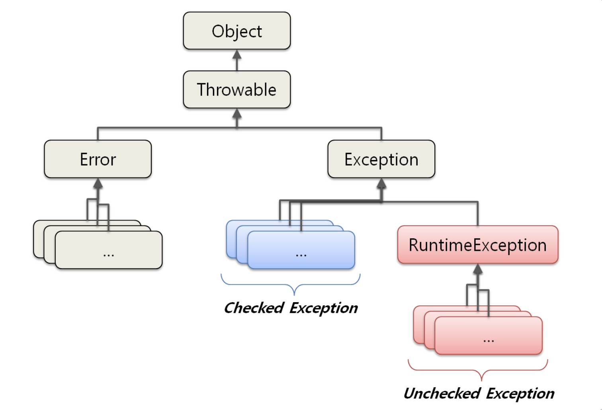

# Java

 

 

 

 

#### JVM에 대해 설명해주세요.

> JVM은 자바 가상 머신으로 자바 바이트 코드를 실행할 수 있는 주체입니다. 
>
> 운영체제 위에서 동작하는 프로세스로 자바 코드를 컴파일해서 얻은 바이트 코드를 해당 운영체제가 이해할 수 있는 기계어로 바꿔 실행시켜주는 역할을 합니다. JVM은 Class Loader, Execution Engine, GC, Runtime Data Area로 구성되어 있습니다.
>
> JVM의 장점은 JVM 위에서 바이트코드는 CPU나 운영체제의 종류와 무관하게 실행이 가능하다는 것과 GC가 메모리를 자동으로 관리해준다는 것입니다.

 

 

 

 

#### JVM 구성 각각에 대해 설명해주세요.

> Class Loader는 JVM내로 클래스(.class파일)를 로드하고, 링크를 통해 배치하는 작업을 수행하는 모듈입니다. 런타임 시에 동적으로 클래스를 로드합니다.
>
> Execution Engine은 메모리에 적재된 클래스(바이트 코드)들을 기계어로 변경해 명령어 단위로 실행하는 역할을 합니다. 그 과정은 인터프리터 방식, JIT 컴파일러를 이용하는 방식이 있습니다.
>
> Garbage Collector(GC)는 Heap 메모리 영역에 생성(적재)된 객체들 중에 참조되지 않는 객체들을 탐색 후 제거하는 역할을 합니다. GC가 수행되는 동안 GC를 수행하는 쓰레드가 아닌 다른 모든 쓰레드가 일시정지되는 특징이 있습니다.
>
> Runtime Data Area는 JVM의 메모리 영역으로 자바 애플리케이션을 실행할 때 사용되는 데이터들을 적재하는 영역입니다. 이 영역은 크게 Method 영역, Heap 영역, Stack 영역, PC Register, Native Method Stack으로 구성되어 있습니다.

 

 

 

 

#### JVM 메모리 공간에 대해 설명해주세요.

> JVM 메모리는 크게 Method 영역, Heap 영역, 스택 영역, PC 레지스터, Native Method Stack으로 구성되어 있습니다.
>
> Method 영역은 클래스 정보를 처음 메모리 공간에 올릴 때 초기화되는 대상을 저장하기 위한 공간입니다. 저장되는 대상은 필드 정보(멤버 변수의 이름, 데이터 타입, 접근 제어자 정보), 메서드 정보(메서드 이름, 리턴 타입, 접근 제어자 정보), 타입 정보(class인지 interface인지), 상수 풀 등이 있습니다.
>
> Heap 영역은 런타임에 동적으로 할당되는 데이터가 저장되는 영역으로 객체나 배열이 이곳에 저장됩니다. 그리고 Garbage Collector가 참조되지 않는 메모리를 확인하고 제거하는 영역입니다.
>
> Stack 영역은 지역변수, 매개변수, 메서드 정보, 임시 데이터 등을 저장하는 영역입니다. 
>
> PC 레지스터는 Thread(쓰레드)가 생성될 때마다 생성되는 영역으로 Program Counter 즉, 현재 쓰레드가 실행되는 부분의 주소와 명령을 저장하고 있는 영역입니다. (CPU의 레지스터와 다름)
>
> Native Method Stack은 자바 외 언어로 작성된 네이티브 코드를 위한 메모리 영역입니다.

 

 

 

 

#### 자바 프로그램 실행 과정을 설명해주세요.

> 1. 프로그램이 실행되면 JVM은 OS로부터 이 프로그램이 필요로 하는 메모리를 할당받습니다. JVM은 이 메모리를 용도에 따라 여러 영역으로 나누어 관리합니다.
> 2. 자바 컴파일러(javac)가 자바 소스코드(.java)를 읽어들여 자바 바이트코드(.class)로 변환시킵니다.
> 3. Class Loader를 통해 바이트 코드(.class)를 JVM 내로 로드하고, 링크하여 Runtime Data Area에 배치합니다. 
> 4. 실행 엔진(Execution Engine)은 JVM 메모리에 올라온 바이트 코드들을 명령어 단위로 하나씩 가져와서 실행합니다. 이때, 실행엔진은 2가지 방식으로 동작할 수 있습니다.
>    - 자바 인터프리터 : 바이트 코드 명령어를 하나씩 읽어서 해석하고 실행합니다. 하나하나의 실행은 빠르나, 전체적인 실행 속도가 느리다는 단점을 가집니다.
>    - JIT 컴파일러(Just-In-Time Compiler) : 인터프리터의 단점을 보완하기 위해 도입된 방식으로 바이트 코드 전체를 컴파일하여 바이너리 코드로 변경하고 이후에는 해당 메서드를 더이상 인터프리팅 하지 않고, 바이너리 코드로 직접 실행하는 방식입니다. 하나씩 인터프리팅하여 실행하는 것이 아니라 바이트 코드 전체가 컴파일된 바이너리 코드를 실행하는 것이기 때문에 전체적인 실행속도는 인터프리팅 방식보다 빠릅니다.
>
> 이러한 실행과정 속에서 JVM은 필요에 따라 Thread Synchronization과 GC 같은 관리작업을 수행합니다.

 

 

 

 

#### GC가 무엇인가요?

> Garbage Collection은 정리되지 않은 메모리, 유효하지 않은 메모리 주소인 가비지를 정리해주는 프로그램입니다. Heap 메모리를 재활용하기 위해 참조되지 않는 객체들을 해제시켜 가용한 공간을 만드는 작업을 수행합니다.
>
> 개발자가 직접 메모리 관리를 하지 않아도 된다는 장점이 있고, GC 실행을 위해 Stop-The-World 상태가 되므로 예측 불가능하게 일시적으로 정지할 수 있다는 단점이 있습니다.

 

 

 

 

#### GC 구성, 과정에 대해 설명해주세요.

> JVM Heap은 Young Generation, Old Generation, Permanent Generation 영역으로 구성되어 있습니다. Young 영역은 Eden 영역과 2개의 Survivor 영역으로 나뉩니다.
>
> 새롭게 생성한 객체의 대부분이 Young Generation에 위치합니다. 대부분의 객체가 금방 접근 불가능 상태가 되기 때문에 매우 많은 객체가 Young 영역에 생성되었다가 사라집니다. 이 영역에서 객체가 사라질때 Minor GC가 발생한다고 말합니다. Young 영역 내부에서 과정은 다음과 같습니다.
>
> - 새로 생성한 대부분의 객체는 Eden 영역에 위치합니다.
> - Eden 영역에서 GC가 한 번 발생한 후 살아남은 객체는 Survivor 영역 중 하나로 이동됩니다.
> - Eden 영역에서 GC가 발생하면 이미 살아남은 객체가 존재하는 Survivor 영역으로 객체가 계속 쌓입니다.
> - 하나의 Survivor 영역이 가득 차게 되면 그 중에서 살아남은 객체를 다른 Survivor 영역으로 이동합니다. 그리고 가득 찬 Survivor 영역은 아무 데이터도 없는 상태로 됩니다.
> - 이 과정을 반복하다가 계속해서 살아남아 있는 객체는 Old 영역으로 이동하게 됩니다.
>
> 접근 불가능 상태로 되지 않아 Young 영역에서 살아남은 객체가 Old 영역으로 복사됩니다. 대부분 Young 영역보다 크게 할당하며, 크기가 큰 만큼 Young 영역보다 GC는 적게 발생합니다. 이 영역에서 객체가 사라질 때 Major GC(혹은 Full GC)가 발생한다고 말합니다.
>
> [Old 영역의 객체가 Young 영역의 객체를 참조하는 경우 확인하는 방법] Old 영역에는 512바이트의 덩어리(chunk)로 되어 있는 카드 테이블(card table)이 존재합니다. 카드 테이블에는 Old 영역에 있는 객체가 Young 영역의 객체를 참조할 때마다 정보가 표시됩니다. Young 영역의 GC를 실행할 때에는 Old 영역에 있는 모든 객체의 참조를 확인하지 않고, 이 카드 테이블만 뒤져서 GC 대상인지 식별합니다.
>
> Permanent 영역은 객체나 억류(intern)된 문자열 정보를 저장하는 곳이며, 여기서 GC가 발생해도 Major GC의 횟수에 포함됩니다.

 

 

 

 

#### GC 종류별로 설명해주세요. (차이, 특징 등)

> - Serial GC
>
> Serial GC는 Young 영역에서는 위의 방법으로 하고, Old 영역은 Mark-Sweep-Compact 알고리즘을 사용합니다. 이 알고리즘의 첫 단계는 Old 영역에 살아 있는 객체를 식별(Mark)하는 것입니다. 그 다음에는 힙(heap)의 앞 부분부터 확인하여 살아 있는 것만 남깁니다(Sweep). 마지막 단계에서는 각 객체들이 연속되게 쌓이도록 힙의 가장 앞 부분부터 채워서 객체가 존재하는 부분과 객체가 없는 부분으로 나눕니다(Compaction). Serial GC는 싱글 쓰레드로 처리하기 때문에 적은 메모리와 CPU 코어 개수가 적을 때 적합한 방식입니다.
>
> - Parallel GC
>
> Parallel GC는 Serial GC와 기본적인 알고리즘은 같습니다. 그러나 Serial GC는 GC를 처리하는 스레드가 하나인 것에 비해, Parallel GC는 GC를 처리하는 쓰레드가 여러 개입니다. 그렇기 때문에 Serial GC보다 빠른게 객체를 처리할 수 있습니다. Parallel GC는 메모리가 충분하고 코어의 개수가 많을 때 유리합니다.
>
> - CMS GC
>
> 초기 Initial Mark 단계에서는 클래스 로더에서 가장 가까운 객체 중 살아 있는 객체만 찾는 것으로 끝냅니다. 따라서, 멈추는 시간은 매우 짧습니다. 그리고 Concurrent Mark 단계에서는 방금 살아있다고 확인한 객체에서 참조하고 있는 객체들을 따라가면서 확인합니다. 이 단계의 특징은 다른 스레드가 실행 중인 상태에서 동시에 진행된다는 것입니다.
>
> 그 다음 Remark 단계에서는 Concurrent Mark 단계에서 새로 추가되거나 참조가 끊긴 객체를 확인합니다. 마지막으로 Concurrent Sweep 단계에서는 쓰레기를 정리하는 작업을 실행합니다. 이 작업도 다른 스레드가 실행되고 있는 상황에서 진행합니다.
>
> 이러한 단계로 진행되는 GC 방식이기 때문에 stop-the-world 시간이 매우 짧습니다. 모든 애플리케이션의 응답 속도가 매우 중요할 때 CMS GC를 사용하며, Low Latency GC라고도 부릅니다.
>
> 단점은 다른 GC 방식보다 메모리와 CPU를 더 많이 사용하며, Compaction 단계가 기본적으로 제공되지 않는다는 것입니다.
>
> - G1 GC
>
> G1 GC는 앞서 살펴본 GC와는 다른 방식으로 힙 메모리를 관리합니다. 앞서 살펴보았던 Eden, Survivor, Old 영역이 존재하지만 고정된 크기로 고정된 위치에 존재하는 것이아니며, 전체 힙 메모리 영역을 Region 이라는 특정한 크기로 나눠서 각 Region의 상태에 따라 그 Region에 역할(Eden, Survivor, Old)이 동적으로 부여되는 상태입니다.
>
> G1 GC에서는 다른 Heap 영역에서 봐왔던 Young, Old와 다른 두 영역 추가로 존재합니다.
>
> Humongous : Region 크기의 50%를 초과하는 큰 객체를 저장하기 위한 공간이며, 이 Region 에서는 GC 동작이 최적으로 동작하지 않습니다.
>
> Available/Unused : 아직 사용되지 않은 Region을 의미합니다.
>
> G1 GC에서 Minor GC를 수행할 때는 STW(Stop-The-World) 현상이 발생하며, STW 시간을 최대한 줄이기 위해 멀티스레드로 GC를 수행합니다. Young GC는 각 Region 중 GC대상 객체가 가장 많은 Region(Eden 또는 Survivor 역할) 에서 수행 되며, 이 Region에서 살아남은 객체를 다른 Region(Survivor 역할) 으로 옮긴 후, 비워진 Region을 사용가능한 Region으로 돌리는 형태로 동작합니다.
>
> G1 GC에서 Major GC가 수행될 때는 Initial Mark -> Root Region Scan -> Concurrent Mark -> Remark -> Cleanup -> Copy 단계를 거치게됩니다.
>
> - Initial Mark
>   - Old Region 에 존재하는 객체들이 참조하는 Survivor Region 을 찾는다. 이 과정에서는 STW 현상이 발생하게 됩니다.
> - Root Region Scan
>   - Initial Mark 에서 찾은 Survivor Region에 대한 GC 대상 객체 스캔 작업을 진행합니다.
> - Concurrent Mark
>   - 전체 힙의 Region에 대해 스캔 작업을 진행하며, GC 대상 객체가 발견되지 않은 Region 은 이후 단계를 처리하는데 제외되도록 합니다.
> - Remark
>   - 애플리케이션을 멈추고(STW) 최종적으로 GC 대상에서 제외될 객체(살아남을 객체)를 식별해냅니다.
> - Cleanup
>   - 애플리케이션을 멈추고(STW) 살아있는 객체가 가장 적은 Region 에 대한 미사용 객체 제거 수행합니다. 이후 STW를 끝내고, 앞선 GC 과정에서 완전히 비워진 Region 을 Freelist에 추가하여 재사용될 수 있게 합니다.
> - Copy
>   - GC 대상 Region이었지만 Cleanup 과정에서 완전히 비워지지 않은 Region의 살아남은 객체들을 새로운(Available/Unused) Region 에 복사하여 Compaction 작업을 수행합니다.
>
> Java 7,8 에서는 Parallel GC이고, Java 9부터 G1 GC를 사용합니다.

 

 

 

 

#### 인터페이스와 추상클래스에 대해 설명해주세요(용도, 차이 등) => 수정 예정

> 인터페이스는 구현하는 클래스에 특정한 메서드가 반드시 존재하도록 강제하는 역할입니다. java 8부터는 default 키워드를 통해 꼭 정의하지 않아도 됨을 명시주는 기능이 추가되었습니다.
>
> 추상 클래스는 실체 클래스에서 공통적인 부분을 추출해 선언한 클래스이고, 반드시 재정의 해야하는 추상메서드를 통해 규격을 제공합니다.
>
> 인터페이스와 추상클래스로는 인스턴스를 생성할 수 없으며, 인터페이스는 다중 상속이 가능하지만 추상 클래스는 다중 상속이 불가능합니다.

 

 

 

 

#### static 에 대해 설명해주세요.

>Static 키워드를 사용한다는 것은 메모리에 한번 할당되어 프로그램이 종료될 때 해제되는 것을 의미합니다. Static 키워드를 사용한 변수나 메서드는 JVM 메모리의 Method 영역에 저장됩니다.
>
>Static 키워드를 통해 Method 영역에 할당된 메모리는 모든 객체가 공유하는 메모리라는 장점을 가지고 있습니다.
>
>Garbage Collector의 관리 영역 밖에 존재하기 때문에 Static을 사용하면 프로그램 종료시까지 메모리가 할당된 채로 존재하게 됩니다. 따라서 무분별하게 사용한다면 오히려 메모리 낭비가 될 수 있다는 단점이 있습니다.

 

 

 

 

#### final 에 대해 설명해주세요.

> 자바에서 final은 단 한 번만 할당할 수 있도록 제한해주는 키워드입니다. 그리고 클래스, 메서드, 변수에 선언함에 따라 각각 특징을 가지고 있습니다.
>
> 클래스에 선언한 경우, 해당 클래스를 다른 클래스가 상속 받을 수 없습니다.
>
> 메서드에 선언한 경우, 해당 메서드를 오버 라이드 할 수 없습니다.
>
> 변수에 선언한 경우, 원시 변수라면 해당 변수의 값을 변경할 수 없고 참조 변수라면 해당 참조 변수가 힙(Heap)의 다른 객체를 가리키도록 할 수 없습니다.  

 

 

 

 

#### 클래스와 인스턴스가 무엇인지 설명해주세요.

> 클래스는 어떤 문제를 해결하기 위한 데이터를 만들기기 위해 속성(attribute)과 행위(behavior)를 변수와 메서드로 정의한 것입니다. 즉, 객체를 만들기 위한 틀입니다.
> 인스턴스는 클래스에서 정의한 것을 토대로 메모리상에 할당된 것으로 실제 프로그램에서 사용되는 데이터입니다. 

 

 

 

 

#### 제네릭에 대해 설명해주세요.

> 제네릭(Generic)은 클래스 내부에서 사용하는 데이터의 타입(Type)을 클래스의 인스턴스를 생성할 때 결정하는 것을 의미합니다. 객체 생성이 가능한 타입에 대해서만 제네릭(Generic) 사용이 가능하며, 생성자 인자로 넣어줄 경우에는 생성시 제네릭을 생략할 수 있습니다.
>
> 제네릭을 사용하면 객체의 타입을 컴파일 시점에 체크하기 때문에 타입 안정성을 높이고 형 변환의 번거로움을 줄일 수 있습니다.

 

 

 

 

#### `class A<T extends B>` 에 대해 설명해주세요.

> T 매개변수의 타입은 B 객체 타입이거나 B 클래스를 상속받는 클래스의 타입만 올 수 있도록 제한하겠다는 의미입니다. 

 

 

 

 

#### 불변객체에 대해 설명해주세요

> 불변객체는 재할당은 가능하지만, 내부 상태를 변경시킬 수 없는 객체입니다.
>
> 원시 타입의 필드는 final 키워드를 사용하고, 참조 타입의 경우에는 추가적인 작업이 필요합니다.
>
> 불변객체의 장점은 객체에 대한 신뢰도가 높아져 믿고 사용할 수 있다는 것과 멀티스레드 환경에서 동기화 처리 없이 객체를 공유할 수 있다는 것입니다.
>
> 단점은 객체가 가지는 값마다 새로운 객체가 필요해서 메모리 누수와 성능 저하가 일어날 수 있습니다.

 

 

 

 

#### 오버라이딩과 오버로딩에 대해 설명해주세요.

> 오버로딩은 한 클래스 내에 이름이 같은 메서드를 여러개 정의하는 것입니다. 파라미터의 자료형이나 갯수가 다르지만 동일한 역할을 하는 메서드를 여러 개 만들 수 있습니다.
>
> 오버라이딩은 상위 클래스의 메서드를 재정의하는 것을 의미합니다. 메서드의 반환type, 파라미터 등은 모두 같으며 내부만 재정의하는 것입니다.

 

  

 

 

#### 동등성과 동일성의 차이는?

> 동일성은 두 객체가 같은 객체인 것을 말하고, 동등성은 두 객체가 동일한 정보를 담고 있는 것을 의미합니다.
>
> 동일성은 == 연산자, 동등성은 equals 메서드를 사용합니다.
>
> 최상위 클래스인 Object의 equals 메서드는 동일성을 확인하도록 되어 있어서 equals 메서드를 오버라이딩해서 동등성을 확인하도록 해야합니다.

 

 

 

 

#### Java Collection 각각에 대해 설명해주세요.

> Java Collection의 핵심 인터페이스는 List, Set, Map이 있습니다.
> 
>List는 순서가 있는 집합이며, 데이터 중복을 허용합니다. 구현 클래스로는 ArrayList, LinkedList, Vector가 있습니다.
> 
>Set은 데이터의 순서를 유지하지 않고, 중복을 허용하지 않습니다. 구현클래스로는 HashSet, TreeSet이 있습니다.
> 
>Map은 Key와 Value의 쌍으로 이루어진 데이터의 집합입니다. 순서는 유지되지 않고, Key의 중복은 허용하지 않으며 Value의 중복은 허용합니다. 구현클래스로는 HashTable, HashMap, TreeMap이 있습니다.

 

 

 

 

#### Java 8에 변경된 부분에 대해 설명해주세요.

> 1. 람다 표현식이 추가되어 기존의 불필요한 코드를 줄여주고, 작성된 코드의 가독성을 높여줍니다.
> 2. 스트림 API가 추가되어 컬렉션이나 배열의 데이터를 간결하게 처리할 수 있습니다.
> 3. 인터페이스에 default 메서드로 작성할 수 있습니다. default 메서드로 구현하면 implement한 클래스가 해당 메서드를 구현하지 않아도 됩니다.
> 4. Optional이 추가되어 값을 Optional로 캡슐화하여 NPE를 막을 수 있습니다.

 

 

 

 

#### Stream API에 대해 설명해주세요.

> 스트림 API는 컬렉션, 배열등의 저장 요소를 하나씩 참조하며 함수형 인터페이스(람다식)를 적용하며 반복적으로 처리할 수 있도록 해주는 기능입니다. 스트림이 제공하는 연산은 생성, 중간 연산, 최종 연산으로 분류할 수 있습니다. 중간 연산에는 map, flatMap, filter 등이 있으며 스트림을 반환하기 때문에 중간 연산을 연결해서 사용할 수 있습니다. 최종 연산에는 collect, reduce 등이 있으며 스트림의 요소를 소모하면서 연산을 수행하기 때문에 단 한번만 연산이 가능합니다.
>
> 장점은
>
> 1. 선언형으로 구현할 수 있어서 간결하고 가독성이 좋아집니다.
> 2. 조립할수있어서 유연성이 좋아집니다.
>
> 특징은
>
> 1. 스트림은 외부 반복을 통해 작업하는 컬렉션과는 달리 내부 반복(internal iteration)을 통해 작업을 수행합니다.
>
> 2. 스트림은 재사용이 가능한 컬렉션과는 달리 단 한 번만 사용할 수 있습니다.
>
> 3. 스트림은 원본 데이터를 변경하지 않습니다.
>
> 4. 스트림의 연산은 필터-맵(filter-map) 기반의 API를 사용하여 지연(lazy) 연산을 통해 성능을 최적화합니다.
>
> 5. 스트림은 parallelStream() 메소드를 통한 손쉬운 병렬 처리를 지원합니다.  

 

 

 

 

#### 람다식에 대해 설명해주세요.

> 람다식은 로컬 익명 구현객체를 생성하게 되는 것이고, 이 람다식의 사용 목적은 인터페이스가 가지고 있는 메서드를 간편하게 즉흥적으로 구현해서 사용하는 것이 목적입니다.
>
> 람다식을 구현하기 위한 인터페이스는 한 개의 추상 메서드만 가져야 합니다. 이렇게 한 개의 추상 메서드만 가진 인터페이스를 Functional Interface라 부릅니다.
>
> 람다식의 장점은 코드를 간결하게 만들 수 있어 가독성이 좋습니다.
>
> 단점은 디버깅이 까다롭습니다.

 

 

 

 

#### Call by value와 Call by reference에 대해 설명해주세요.

> `Call by value` 호출 방식은 함수 호출 시 전달되는 변수 값을 복사해서 함수 인자로 전달합니다. 이때 복사된 인자는 함수 안에서 지역적으로 사용되기 때문에 local value 속성을 가집니다. 따라서, 함수 안에서 인자 값이 변경되더라도, 외부 변수 값은 변경이 되지 않습니다.
>
> `Call by reference` 호출 방식은 함수 호출 시 인자로 전달되는 변수의 레퍼런스를 전달합니다. 따라서 함수 안에서 인자 값이 변경되면, 아규먼트로 전달된 객체의 값도 변경됩니다.

 

 

 

#### Java는 Call by value일까요, Call by reference 일까요?

> Java는 Call by value라고 생각합니다. 함수의 인자가 원시 자료형인 경우엔 값을 넘기므로 당연히 Call by value라 생각됩니다. 하지만 인자가 참조 자료형일 때는 레퍼런스를 넘기는 것처럼 보이지만, 실제론 매개변수로 넘어오는 변수가 가리키는 인스턴스 메모리 주소를 넘겨주므로 Call by value입니다. 

 

 

 

 

#### String VS StringBuilder VS StringBuffer ?

> 한번 생성된 String 인스턴스가 갖고 있는 문자열은 읽어 올 수만 있고, 변경할 수는 없습니다. `+` 연산자를 이용해서 문자열을 결합하는 경우, 인스턴스 내의 문자열이 바뀌는 것이 아니라 새로운 문자열이 담긴 String 인스턴스가 생성되어 메모리 공간을 차지하게 됩니다. 따라서 GC(Garbage Collector)가 호출되기 전까지 연산할 때 쓰인 String들이 heap에 계속 쌓이므로 메모리 관리 측면에서 치명적입니다.
>
> String 클래스는 인스턴스를 생성할 때 지정된 문자열을 변경할 수 없지만 StringBuffer 클래스는 변경이 가능합니다. 내부적으로 문자열 편집을 위한 버퍼(buffer)를 가지고 있으며, StringBuffer 인스턴스를 생성할 때 그 크기를 지정할 수 있다.
>
> StringBuffer는 멀티쓰레드에 안전(thread safe)하도록 동기화되어 있습니다. 따라서 멀티쓰레드로 작성된 프로그램이 아닌 경우, StringBuffer의 동기화는 불필요하게 성능만 떨어뜨리게 됩니다.
>
> 그래서 StringBuffer에서 쓰레드의 동기화만 뺀 StringBuilder가 추가된 것입니다. StringBuilder는 StringBuffer와 완전히 똑같은 기능으로 작성되어 있습니다.

 

 

 

 

#### Checked Exception VS Unchecked Exception

> Checked Exception은 컴파일 단계에서 발견되는 예외이며 반드시  `try/catch` 로 감싸거나 `throw` 로 던져서 처리해야 합니다. 그리고 예외 발생 시 트랜잭션을 roll back 하지 않고 예외를 던저줍니다. Checked Exception의 대표적 예는 IOException, SQLException이 있습니다.
>
> Unchecked Exception은 실행 단계에서 발견되는 예외이며 명시적인 처리를 강제하지 않습니다. 그리고 예외 발생 시 트랜잭션을 roll back 합니다. Unchecked Exception의 대표적 예는 NullPointerException, IllegalArgumentException, IndexOutOfBoundException이 있습니다.

 

 

 

 

#### 예외 처리 방법에 대해 설명해주세요.

> 

 

 

 

 

#### Reference

> - [JVM-Jbee님](https://asfirstalways.tistory.com/158)
> - [JVM-정아마추어님](https://jeong-pro.tistory.com/148)
> - [자바 프로그램 실행 과정 - CODEMCD님](https://github.com/CODEMCD/technical-interview-speaking/tree/master/JAVA)
> - [제네릭](https://lktprogrammer.tistory.com/177)
> - [GC-Naver D2 이상민님](https://d2.naver.com/helloworld/1329)
> - [Call by value vs Call by reference - 머루의 개발블로그](http://wonwoo.ml/index.php/post/1679)
> - [Checked Exception VS Unchecked Exception](http://www.nextree.co.kr/p3239/)
