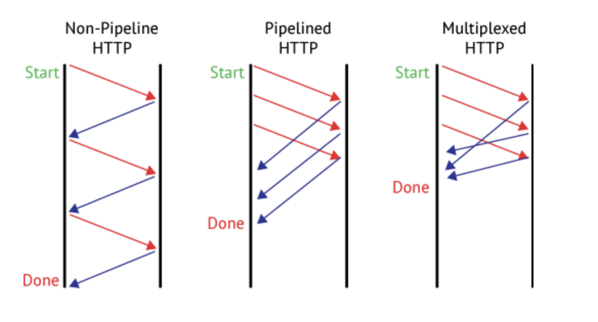
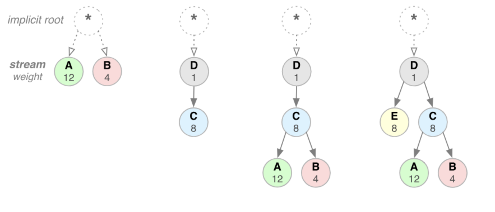
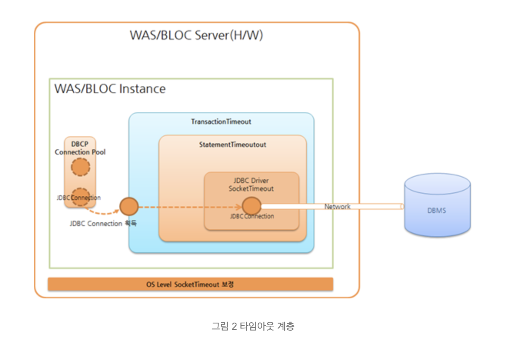

# Network

 

 

 

 

#### HTTP가 뭔가요?

> HTTP는 텍스트 기반의 통신 규약으로 인터넷에서 데이터를 주고받을 수 있는 프로토콜입니다. 규약을 정해두었기 때문에 모든 프로그램이 이 규약에 맞춰 개발해서 서로 정보를 교환할 수 있게 되었습니다.
>
> HTTP 특징은
>
> - HTTP 메시지는 HTTP 서버와 HTTP 클라이언트에 의해 해석이 됩니다.
> - TCP/ IP를 이용하는 응용 프로토콜입니다.
> - HTTP는 연결 상태를 유지하지 않는 비연결성 프로토콜이다. 비연결성으로 인해 TCP 연결을 위한 오버헤드를 해결하고자 HTTP 1.1에서 Keep-Alive 기능이 추가되었습니다.
> - HTTP는 클라이언트의 이전 상태를 알 수 없는 무상태성 프로토콜입니다. 무상태성으로 인해 클라이언트를 식별하지 못하는 문제를 해결하기 위해 Session과 Cookie를 이용합니다.

 

 

 

 

#### 비연결성(Connectless)에 대해 자세히

> 

 

 

 

 

#### 무상태성(Stateless)에 대해 자세히

> 

 

 

 

 

#### HTTP2.0

> 1. Multiplexed Streams
>
>    한 커넥션으로 동시에 여러개의 메세지를 주고 받을 있으며, 응답은 순서에 상관없이 stream으로 주고 받습니다. HTTP/1.1의 Connection Keep-Alive, Pipelining의 개선이라 보면 됩니다.
>
>    
>
>     
>
>     
>
> 2. Stream Prioritization
>
>    클라이언트가 요청한 HTML문서 안에 CSS파일 1개와 Image파일 2개가 존재하고 이를 클라이언트가 각각 요청하고 난 후 Image파일보다 CSS파일의 수신이 늦어지는 경우 브라우저의 렌더링이 늦어지는 문제가 발생하는데 HTTP/2의 경우 리소스간 의존관계(우선순위)를 설정하여 이런 문제를 해결하는 것입니다.
>
>    
>
>     
>
>     
>
> 3. Server Push: 서버 푸시
>
>    서버 푸시는 클라이언트가 달라고 하지도 않은 리소스를 서버가 마음대로 보낼 수 있는 기능입니다.
>
>    클라이언트(브라우저)가 HTML문서를 요청했고 해당 HTML에 여러개의 리소스(CSS, Image...) 가 포함되어 있는경우 HTTP/1.1에서 클라이언트는 요청한 HTML문서를 수신한 후  HTML문서를 해석하면서 필요한 리소스를 재 요청하는 반면 HTTP/2에선 Server Push기법을 통해서 클라이언트가 요청하지도 않은 (HTML문서에 포함된 리소스) 리소스를 Push 해주는 방법으로 클라이언트의 요청을 최소화 해서 성능 향상을 이끌어 냅니다. 이를 PUSH_PROMISE 라고 부르며 PUSH_PROMISE를 통해서 서버가 전송한 리소스에 대해선 클라이언트는 요청을 하지 않습니다.
>
>    
>
>     
>
>     
>
> 4. Header Compression: 헤더 압축
>
>    HTTP/2에선 Header에 중복값이 존재하는 경우 Static/Dynamic Header Table 개념을 사용하여 중복 Header를 검출하고 중복된 Header는 index값만 전송하고 중복되지 않은 Header정보의 값은  Huffman Encoding 기법으로 인코딩 처리 하여 전송합니다.

 

 

 

 

#### HTTP와 HTTPS 차이에 대해 설명해주세요

> 

 

 

 

 

#### Timeout에 대해

> **Connection Timeout이란?**
>
> 클라이언트가 어떤 사유로 인해서 서버에 접근자체를 실패했을시 적용되는 것이 Connection Timeout입니다. 접근을 시도하는 시간제한이 Connection Timeout이 됩니다.
>
> 웹 브라우저가 서버에 접속하기 위해선 3-way Handshake가 일어나는데, 3-way handshake가 정상적으로 끝나야 connection이 됬다고 표현할 수 있습니다. 따라서 Connection Timeout은 Connection을 구성하는데 소요되는 시간의 임계치라고도 할 수 있습니다.

 

> **Read Timeout**이란?
>
> 클라이언트와 서버가 connection은 맺어졌지만 I/O작업이 길어지거나 락이 걸려 요청이 처리되지 못하고 있을 때 클라이언트는 더 이상 기다리지 못하고 커넥션을 끊습니다. 이런 상황을 Read Timeout 이라고 하는데 java에서는 SocketTimeout Exception이 떨어집니다.

 

> **Statement Timeout**이란?
>
> Statement 하나가 얼마나 오래 수행되어도 괜찮은지에 대한 한계 값입니다. JDBC API인 Statement에 타임아웃 값을 설정하며, 이 값을 바탕으로 JDBC 드라이버가 StatementTimeout을 처리합니다. JDBC API인 java.sql.Statement.setQueryTimeout(int timeout) 메서드로 설정합니다.

 

> **Transaction Timeout**이란?
>
> TransactionTimeout은 프레임워크(Spring, EJB Container)나 애플리케이션 레벨에서 유효한 타임아웃입니다.
>
> 간단히 설명하면 "StatementTimeout x N(Statement 수행 수) + α(가비지 컬렉션 및 기타)"라고 할 수 있습니다. 전체 Statement 수행 시간을 허용할 수 있는 최대 시간 이내로 제한하려 할 때 TransactionTimeout을 사용합니다.
>
> 가령 Statement 한 개를 수행할 때 0.1초가 필요하다면, 몇 개 안 되는 Statement를 수행할 때에는 문제가 없습니다. 그러나 Statement 10만 개를 수행할 때에는 일만 초(약 7시간)가 필요합니다. TransactionTimeout은 이런 경우에 사용할 수 있습니다.

 

 

 

 

#### 3-way handshake

> 3way handshake는 TCP/IP 프로토콜을 이용해서 통신을 하는 응용 프로그램이 데이터를 전송하기 전에 먼저 정확한 전송을 보장하기 위해 상대방 컴퓨터와 사전에 세션을 수립하는 과정입니다.
>
> 과정(A: 클라이언트, B: 서버)
>
> 1. A → B: SYN
>    - 접속 요청 프로세스 A가 연결 요청 메시지 전송 (SYN)
>      송신자가 최초로 데이터를 전송할 때 Sequence Number를 임의의 랜덤 숫자로 지정하고, SYN 플래그 비트를 1로 설정한 세그먼트를 전송한다.
> 2. B → A: SYN + ACK
>    - 접속 요청을 받은 프로세스 B가 요청을 수락했으며, 접속 요청 프로세스인 A도 포트를 열어 달라는 메시지 전송 (SYN + ACK)
>      수신자는 Acknowledgement Number 필드를 (Sequence Number + 1)로 지정하고, SYN과 ACK 플래그 비트를 1로 설정한 세그먼트를 전송한다.
> 3. A → B: ACK
>    - 마지막으로 접속 요청 프로세스 A가 수락 확인을 보내 연결을 맺음 (ACK)
>      이때, 전송할 데이터가 있으면 이 단계에서 데이터를 전송할 수 있다.

 

 

 

#### 4-way Handshake

> 4-way handshake는 TCP의 연결을 해제(Connection Termination) 하는 과정입니다.
>
> 과정(A: 클라이언트, B: 서버)
>
> 1. A → B: FIN
>    프로세스 A가 연결을 종료하겠다는 FIN 플래그를 전송
>    프로세스 B가 FIN 플래그로 응답하기 전까지 연결을 계속 유지
> 2. B → A: ACK
>    프로세스 B는 일단 확인 메시지를 보내고 자신의 통신이 끝날 때까지 기다린다. (이 상태가 TIME_WAIT 상태)
>    수신자는 Acknowledgement Number 필드를 (Sequence Number + 1)로 지정하고, ACK 플래그 비트를 1로 설정한 세그먼트를 전송한다.
>    그리고 자신이 전송할 데이터가 남아있다면 이어서 계속 전송한다.
> 3. B → A: FIN
>    프로세스 B가 통신이 끝났으면 연결 종료 요청에 합의한다는 의미로 프로세스 A에게 FIN 플래그를 전송
> 4. A → B: ACK
>    프로세스 A는 확인했다는 메시지를 전송
>

 

 

 

## REFERENCE

> - [HTTP/2.0](https://www.popit.kr/나만-모르고-있던-http2/)
> - [Timeout - 네이버 D2](https://d2.naver.com/helloworld/1321)
> - [3-way handshake, 4-way handshake](https://gmlwjd9405.github.io/2018/09/19/tcp-connection.html)