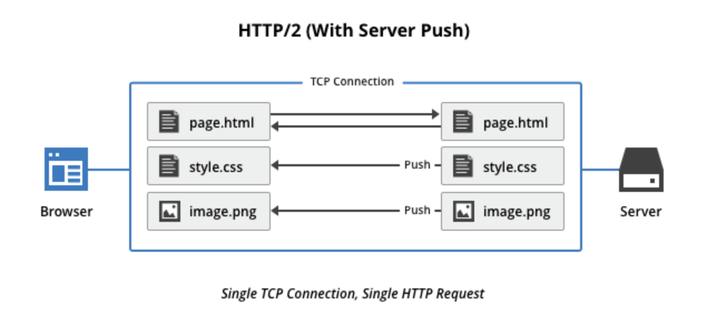

# Network

 

 

 

 

#### HTTP2.0

> 1. Multiplexed Streams
>
>    한 커넥션으로 동시에 여러개의 메세지를 주고 받을 있으며, 응답은 순서에 상관없이 stream으로 주고 받습니다. HTTP/1.1의 Connection Keep-Alive, Pipelining의 개선이라 보면 됩니다.
>
>    
>
>     
>
>     
>
> 2. Stream Prioritization
>
>    클라이언트가 요청한 HTML문서 안에 CSS파일 1개와 Image파일 2개가 존재하고 이를 클라이언트가 각각 요청하고 난 후 Image파일보다 CSS파일의 수신이 늦어지는 경우 브라우저의 렌더링이 늦어지는 문제가 발생하는데 HTTP/2의 경우 리소스간 의존관계(우선순위)를 설정하여 이런 문제를 해결하는 것입니다.
>
>    
>
>     
>
>     
>
> 3. Server Push: 서버 푸시
>
>    서버 푸시는 클라이언트가 달라고 하지도 않은 리소스를 서버가 마음대로 보낼 수 있는 기능입니다.
>
>    클라이언트(브라우저)가 HTML문서를 요청했고 해당 HTML에 여러개의 리소스(CSS, Image...) 가 포함되어 있는경우 HTTP/1.1에서 클라이언트는 요청한 HTML문서를 수신한 후  HTML문서를 해석하면서 필요한 리소스를 재 요청하는 반면 HTTP/2에선 Server Push기법을 통해서 클라이언트가 요청하지도 않은 (HTML문서에 포함된 리소스) 리소스를 Push 해주는 방법으로 클라이언트의 요청을 최소화 해서 성능 향상을 이끌어 냅니다. 이를 PUSH_PROMISE 라고 부르며 PUSH_PROMISE를 통해서 서버가 전송한 리소스에 대해선 클라이언트는 요청을 하지 않습니다.
>
>    
>
>     
>
>     
>
> 4. Header Compression: 헤더 압축
>
>    HTTP/2에선 Header에 중복값이 존재하는 경우 Static/Dynamic Header Table 개념을 사용하여 중복 Header를 검출하고 중복된 Header는 index값만 전송하고 중복되지 않은 Header정보의 값은  Huffman Encoding 기법으로 인코딩 처리 하여 전송합니다.

 

 

 

 

#### HTTP와 HTTPS 차이에 대해 설명해주세요

> 

 

 

 

 

#### HTTP 특징에 대해 설명해주세요

 

 

 

 

## REFERENCE

> - [HTTP/2.0](https://www.popit.kr/나만-모르고-있던-http2/)