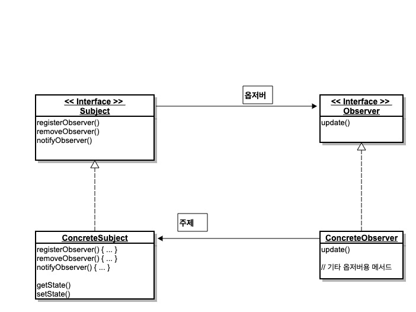

# Software Engineering

 

 

 

 

 

#### OOP가 무엇인가요?

> OOP는 프로그래밍에서 필요한 데이터를 추상화시켜 상태(속성, 어트리뷰트)와 행위(메서드)를 가진 객체로 만들고 그 객체들 간의 메시지를 통해 상호작용하도록  로직을 구성하는 프로그래밍 방법입니다. 
>
> OOP의 장점은 재사용성과 유지보수의 용이성입니다. 기존에 구현한 것들을 상속과 다형성을 이용해서 쉽게 재사용할 수 있으며, 수정해야 할 부분이 멤버 변수 또는 메서드이므로 유지보수하기 편합니다.
> 단점은 처리 속도가 상대적으로 느립니다.
>
> OOP의 특징으로는 캡슐화, 추상화, 상속, 다형성이 있습니다.

 

 

 

#### 객체들 간의 메시지를 통해 상호작용하도록 하는 이유는 무엇인가요?

> 

 

 

 

#### OOP의 특징에 대해 소개해주세요

> > - 추상화
> >
> > 추상화는 구현하는 객체들이 가진 공통적인 데이터와 기능을 도출해 내는 것입니다.
> >
> > 추상화를 적절히 시키면 코드의 재사용성, 가독성을 높입니다.
>
> > - 캡슐화
> >
> > 캡슐화는 객체의 상세한 내용은 객체의 외부로부터 숨기고 제한된 데이터와 메서드만을 노출시켜 객체와 상호작용 할 수 있도록 하는것입니다. 변하기 쉽고 감추고 싶은 정보는 외부에서 접근하지 못하도록 은닉하고 필요한 메서드들만 공개하여 기능을 수행할 수 있도록 합니다.
>
> > - 상속
> >
> > 상속은 부모클래스의 속성과 기능을 그대로 이어받아 사용할 수 있게하고 기능의 일부분을 변경해야 할 경우 상속받은 자식클래스에서 해당 기능만 다시 수정(정의)하여 사용할 수 있게 하는 것입니다. 그리고 자식 클래스를 외부로부터 은닉하는 캡슐화의 일종입니다.
>
> > - 다형성
> >
> > 다형성은 서로 다른 클래스의 객체가 같은 메시지를 받았을 때 각자의 방식으로 동작하는 능력입니다. 
> >
> > 다형성을 사용하는 경우에는 구체적으로 현재 어떤 클래스 객체가 참조되는지와 무관하게 프로그래밍을 할 수 있습니다.
> > 일반화 관계에 있을 때 부모 클래스의 참조 변수가 자식 클래스의 객체를 참조할 수 있기 때문에 새로운 자식 클래스가 추가되더라도 코드는 영향을 받지 않습니다.

  

 

#### OOP 5대 원칙(SOLID)에 대해 소개해주세요

>OOP 5대 원칙은 SRP(단일 책임 원칙), OCP(개방-폐쇄 원칙), LSP(리스코프 치환 원칙), ISP(인터페이스 분리 원칙), DIP(의존 역전 원칙)이 있습니다.
>이 원칙들은 시스템에 예상하지 못한 변경사항이 발생하더라도, 유연하게 대처하고 이후에 확장성이 있는 시스템 구조를 설계할 수 있도록 해줍니다.
>
>- SRP(Single Responsibility Principle)
>
>  - SRP는 단일 책임원칙으로, 객체는 단 하나의 책임만 가져야 한다는 원칙입니다.
>    한 클래스에 단 하나의 책임만 수행하도록 해 변경 사유가 될 수 있는 것을 하나로 만들어야 한다.
>    책임을 많이 질수록 클래스 내부에서 서로 다른 역할을 수행하는 코드끼리 강하게 결합될 가능성이 높아진다.
>- OCP(Open Closed Principle)
>
>  - OCP란 개방 폐쇄 원칙입니다. 기존의 코드를 변경하지 않으면서 기능을 수정하거나 추가할 수 있어야 한다는 것입니다.
>    자주 변경되는 내용은 수정하기 쉽게 설계 하고, 변경되지 않아야 하는 것은 수정되는 내용에 영향을 받지 않게 하는 것이 포인트입니다. 이를 위해 자주 사용되는 문법이 인터페이스(Interface)입니다.
>- LSP(Liskov Substitution Principle)
>
>  - LSP는 리스코프 치환 원칙입니다. 자식 클래스는 최소한 자신의 부모 클래스에서 가능한 행위는 수행할 수 있어야 한다는 것입니다.
>    LSP를 만족하면 프로그램에서 부모 클래스의 인스턴스 대신에 자식 클래스의 인스턴스로 대체해도 프로그램의 의미는 변화되지 않는다.
>- ISP(Interface Segregation Principle)
>  - ISP는 인터페이스 분리 원칙입니다. 한 클래스는 자신이 사용하지 않는 인터페이스는 구현하지 말아야 합니다. 하나의 일반적인 인터페이스보다는, 여러 개의 구체적인 인터페이스가 낫다는 것입니다.
>- DIP(Dependency Inversion Principle)
>
>  - DIP란 의존 역전 원칙입니다. 의존 관계를 맺을 때 변화하기 쉬운 것 또는 자주 변화하는 것보다는 변화하기 어려운 것, 거의 변화가 없는 것에 의존하라는 것입니다. DIP를 만족시키려면 구체적인 클래스보다 인터페이스나 추상 클래스와 의존 관계를 맺도록 설계해야 합니다.
>    예를 들어, Car 클래스가 구체적인 snow 타이어를 의존하는 것이 아니라, 그것을 추상화한 tire 인터페이스를 의존해야하는 것입니다. tire의 구체클래스는 snow tire, 일반 tire 등이 있습니다.

 

 

 

## Design Pattern

 

 

 

#### 싱글톤 패턴에 대해 설명해주세요

> 싱글톤 패턴은 애플리케이션이 시작될 때 어떤 클래스가 최초 한번만 메모리를 할당하고(Static) 그 메모리에 인스턴스를 만들어 사용하는 디자인패턴입니다. 주로 공통된 객체를 여러개 생성해서 사용해야하는 상황에서 싱글톤 패턴을 사용하고, 대표적으로 데이터베이스에서 커넥션풀, 스레드풀, 캐시, 로그 기록 객체에 사용됩니다.
>
> 장점은 한번의 new를 통해 객체를 생성해 메모리 낭비를 방지할 수 있습니다. 또한 싱글톤으로 구현한 인스턴스는 '전역'이므로, 다른 클래스의 인스턴스들이 데이터를 공유하는 것이 가능한 장점이 있다.
>
> 단점은 싱글톤 인스턴스가 혼자 너무 많은 일을 하거나, 많은 데이터를 공유시키면 다른 클래스들 간의 결합도가 높아지게 되는데, 이때 개방-폐쇄 원칙이 위배됩니다. 결합도가 높아지게 되면, 유지보수가 힘들고 테스트도 원활하게 진행할 수 없는 문제점이 발생합니다.
>
> 멀티쓰레드에서 안전한 싱글톤을 구현하는 방법은 세가지가 있습니다.
>
> 1. Thread safe Lazy initialization (게으른 초기화)
>
> ~~~ java
> public class ThreadSafeLazyInitialization{
>  
>     private static ThreadSafeLazyInitialization instance;
>  
>     private ThreadSafeLazyInitialization(){}
>      
>     public static synchronized ThreadSafeLazyInitialization getInstance(){
>         if(instance == null){
>             instance = new ThreadSafeLazyInitialization();
>         }
>         return instance;
>     }
> }
> ~~~
>
> private static으로 인스턴스 변수를 만들고 private 생성자로 외부에서 생성을 막았으며 synchronized 키워드를 사용해서 thread-safe하게 만들었습니다.
>
> 하지만 synchronized 특성상 비교적 큰 성능저하가 발생하므로 권장하지 않는 방법입니다.
>
> 2. Thread safe lazy initialization + Double-checked locking - 게으른 초기화의 성능저하를 완화시키는 방법
>
> ~~~ java
> public class ThreadSafeLazyInitialization {
>  
>     private volatile static ThreadSafeLazyInitialization instance;
>  
>     private ThreadSafeLazyInitialization(){}
>      
>     public static ThreadSafeLazyInitialization getInstance(){
>         
>         if(instance == null){
>             synchronized (ThreadSafeLazyInitialization.class) {
>                 if(instance == null)
>                     instance = new ThreadSafeLazyInitialization();
>             }
>  
>         }
>         return instance;
>     }
> }
> ~~~
>
> getInstance()에 synchronized를 사용하는 것이 아니라 첫 번째 if문으로 인스턴스의 존재여부를 체크하고 두 번째 if문에서 다시 한번 체크할 때 동기화 시켜서 인스턴스를 생성하므로 thread-safe하면서도 처음 생성 이후에 synchonized 블럭을 타지 않기 때문에 성능저하를 완화했습니다. 그러나 완벽한 방법은 아닙니다.
>
> 3. Initialization on demand holder idiom (holder에 의한 초기화)
>
> ~~~ java
> public class Something {
>     private Something() {
>     }
>  
>     private static class LazyHolder {
>         public static final Something INSTANCE = new Something();
>     }
>  
>     public static Something getInstance() {
>         return LazyHolder.INSTANCE;
>     }
> }
> ~~~
>
> 이 방법은 JVM의 클래스 초기화 과정에서 보장되는 원자적 특성을 이용하여 싱글턴의 초기화 문제에 대한 책임을 JVM에 떠넘깁니다.
>
> holder안에 선언된 instance가 static이기 때문에 클래스 로딩시점에 한번만 호출될 것이며 final을 사용해 다시 값이 할당되지 않도록 만든 방법입니다. 가장 많이 사용되는 방법입니다.

 

 

 

#### 팩토리 메서드 패턴(Factory Method Pattern)

> 팩토리 메서드 패턴은 객체 생성 처리를 서브 클래스로 분리 해 처리하도록 캡슐화하는 패턴입니다. 객체의 생성 코드를 별도의 클래스/메서드로 분리함으로써 객체 생성의 변화에 대비하는 데 유리합니다.
>
> 팩토리 메소드 패턴을 사용하는 이유는 클래스간의 결합도를 낮추기 위한것입니다. 결합도라는 것은 간단히 말해 클래스의 변경점이 생겼을 때 얼마나 다른 클래스에도 영향을 주는가입니다. 팩토리 메소드 패턴을 사용하는 경우 직접 객체를 생성해 사용하는 것을 방지하고 서브 클래스에 위임함으로써 보다 효율적인 코드 제어를 할 수 있고 의존성을 제거합니다. 결과적으로 결합도 또한 낮출 수 있습니다.

 

 

 

#### 전략 패턴(Strategy Pattern)

> 객체들이 할 수 있는 행위 각각에 대해 전략 클래스를 생성하고, 유사한 행위들을 캡슐화 하는 인터페이스를 정의하여, 객체의 행위를 동적으로 바꾸고 싶은 경우 직접 행위를 수정하지 않고 전략을 바꿔주기만 함으로써 행위를 유연하게 확장하는 방법을 말합니다.

 

 

 

#### 옵저버 패턴(Observer Pattern)

> 옵저버 패턴은 한 객체의 상태가 바뀌면 그 객체에 의존하는 다른 객체들한테 연락이 가고 자동으로 내용이 갱신되는 방식으로 일대다 의존성을 정의합니다.
>
> 옵저버 패턴은 주제를 나타내는 Subject인터페이스와 그것을 구현한 주제 클래스, 주제의 상태가 바뀌었을 때 호출되는 update 메서드를 가지고 있는 Observer 인터페이스, 그리고 그것의 구현 클래스로 구성되어 있습니다.
>
> 
>
> 옵저버 패턴은 주제와 옵저버가 느슨하게 결합되어 있는 객체 디자인을 제공합니다. 이로 인해 여러 장점이 생깁니다.
>
> 1. 주제가 옵저버에 대해서 아는 것은 옵저버가 특정 인터페이스(Observer 인터페이스)를 구현한다는 것 뿐입니다.
> 2. 옵저버는 언제든 새로 추가할 수 있습니다.
> 3. 새로운 형식의 옵저버를 추가하려고 할 때도 주제를 전혀 변경할 필요가 없습니다.
> 4. 주제와 옵저버는 서로 독립적으로 재사용할 수 있습니다.
> 5. 주제나 옵저버가 바뀌더라도 서로한테 영향을 미치지 않습니다.
>
>  
>
> WetherData 객체(기상 스테이션으로부터 오는 데이터를 추적하는 객체), 그리고 사용자에게 현재 기상 조건을 보여주는 디스플레이의 예
>
> ~~~ java
> public interface Subject {
>   public void registerObserver (Observer o);
>   public void removeObserver (Observer o);
>   public void notifyObservers();
> }
> 
> public interface Observer {
>   public void update (float temp, float humidity, float pressure);
> }
> 
> public interface DisplayElement {
>   public void display();
> }
> ~~~
>
> ~~~ java
> public class WeatherData implements Subject {
>   private ArrayList<Observer> observers;
>   private float temperature;
>   private float humidity;
>   private float pressure;
>   
>   public WetherData() {
>     this.observers = new ArrayList<>();
>   }
>   
>   public void registerObserver(Observer o) {
>     observers.add(o);
>   }
>   
>   public void removeObserver(Observer o) {
>     int index = observers.indexOf(o);
>     if (index >= 0) {
>       observers.remove(index);
>     }
>   }
>   
>   public void notifyObservers() {
>     for (Observer observer : observers) {
>       observer.update(temperature, humidity, pressure);
>     }
>   }
>   
>   public void measurementsChanged() {
>     notifyObservers();
>   }
>   
>   public void setMeasurements(float temperature, float humidity, float pressure) {
>     this.temperature = temperature;
>     this.humidity = humidity;
>     this.pressure = pressure;
>     measurementsChanged();
>   }
>   
>   // 기타 WeatherData 메서드
> }
> ~~~
>
> ~~~ java
> public class CurrentConditionsDisplay implements Observer, DisplayElement {
>   private float temperature;
>   private float humidity;
>   private Subject weatherData;
>   
>   public CurrentConditionsDisplay(Subject weatherData) {
>     this.weatherData = weatherData;
>     weatherData.registerObserver(this);
>   }
>   
>   public void update(float temperature, float humidity, float pressure) {
>     this.temperature = temperature;
>     this.humidity = humidity;
>     display();
>   }
>   
>   public void display() {
>     System.out.println("Current conditions: " + temperature + "F degrees and " + humidity + "% humidity")
>   }
> }
> ~~~
>
> 
>
> 옵저버 패턴은 직접 구현할 수도 있지만 자바에 내장된 옵저버 패턴을 사용할 수 있습니다.

 

 

 

## Reference

> - [싱글톤 패턴 - 정아마추어님](https://jeong-pro.tistory.com/86)
> - [전략 패턴 - Limky님](https://limkydev.tistory.com/84)
> - [팩토리 메서드 패턴 - JDM's blog](https://jdm.kr/blog/180)

