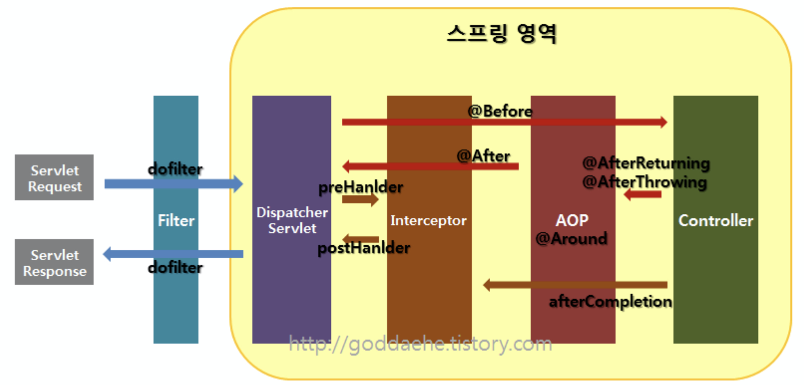

# Web(Spring)

 

 

 

#### Spring Framework의 주요 특징에 대해 소개해주세요.

> Spring Framework의 특징은
>
> 1. 첫번째, 경량 컨테이너로서 자바 객체를 직접 관리합니다.
>    각각의 객체 생성, 소멸과 같은 라이프 사이클을 관리하며 스프링으로부터 필요한 객체를 얻어올 수 있습니다.
> 2. 두번째, 제어의 역행(IoC)입니다.
>    컨트롤의 제어권이 사용자가 아니라 프레임워크에 있어 필요에 따라 스프링에서 사용자의 코드를 호출합니다.
> 3. 세번째, 의존성 주입(DI)입니다.
>    각각의 계층이나 서비스들 간에 의존성이 존재할 경우 프레임워크가 서로 연결시켜줍니다.
> 4. 네번째, 관점지향 프로그래밍(AOP)입니다.
>    트랜잭션이나 로깅, 보안과 같이 여러 모듈에서 공통적으로 사용하는 기능의 경우 해당 기능을 분리하여 관리할 수 있습니다.

 

 

 

#### Spring, Spring Boot, Spring MVC 차이는 무엇인가요

> 

 

 

 

#### IoC에 대해 설명해주세요

> 

 

 

 

#### DI에 대해 설명해주세요

> DI는 객체 자체가 아니라 프레임워크에 의해 객체의 의존성이 주입되는 것입니다. 각 클래스 사이에 필요로 하는 의존관계를 Bean 설정 정보 바탕으로 스프링 컨테이너가 자동으로 연결합니다.
>
> DI의 장점은
>
> 1. 결합도가 낮아지게 되어서 유지보수와 확장에 유리합니다.
> 2. 의존 객체를 Mock으로 대체할 수 있으므로 테스트가 용이해집니다.
> 3. 종속성이 감소합니다. 구성 요소의 종속성이 감소하면, 변경에 민감하지 않습니다.

 

 

 

#### Dispatcher Servlet에 대해 설명해주세요.

> Dispatcher Servlet는 클라이언트의 모든 요청을 받아서 필요한 처리를 하고, 요청에 맞는 Handler로 요청을 Dispatch하고, 해당 Handler의 실행결과를 HTTP Response로 만드는 역할을 합니다.

 

 

 

#### AOP에 대해 설명해주세요

> AOP는 어플리케이션의 핵심적인 기능에서 부가적인 기능을 분리해서 애스펙트라는 모듈로 만들어서 설계하고 개발하는 방법입니다. 즉, 공통 부분을 모듈로 분리하는 것이며 주로 인증, 로깅, 트랜잭션 처리에 사용됩니다.

 

 

 

#### AOP의 용어들에 대해 설명해주세요(Target, Aspect, Advice, PointCut, JoinPoint 등)

> Aspect: 애스펙트는 AOP의 기본 모듈이며, 애스펙트는 부가기능을 정의한 코드인 어드바이스(Advice)와 어드바이스를 어디에 적용하지를 결정하는 포인트컷(PointCut)을 합친 개념입니다.
>
> Target: 핵심 기능을 담고 있는 모듈로 타겟은 부가기능을 부여할 대상입니다.
>
> Advice: 어드바이스는 타겟에 제공할 부가기능을 담고 있는 모듈입니다.
>
> PointCut: 어드바이스를 적용할 타겟의 메서드를 선별하는 정규표현식입니다.
>
> Weaving: 위빙은 포인트컷에 의해서 결정된 타겟의 조인 포인트에 부가기능(어드바이스)를 삽입하는 과정을 뜻합니다.

 

 

 

#### Spring AOP의 특징에 대해 설명해주세요.

> 첫번째 특징은 Spring이 프록시 기반 AOP를 지원하는 것입니다.
> Spring은 타겟 객체에 대한 프록시를 만들어 제공하고, 그 프록시는 런타임에 생성됩니다.
>
> 두번째 특징은 프록시가 호출을 가로채는 것입니다. 프록시는 타겟 객체에 대한 호출을 가로챈 다음 어드바이스의 부가기능 로직을 수행하고 난 후에 타겟의 핵심기능 로직을 호출합니다. 혹은 호출을 가로챈 후 핵심기능 로직을 호출한 후에 부가기능을 수행합니다.
>
> 세번째 특징은 Spring이 동적 프록시를 기반으로 AOP를 구현하므로 메서드 조인 포인트만 지원하는 것입니다. 핵심기능(타겟)의 메서드가 호출되는 런타임 시점에만 부가기능(어드바이스)을 적용할 수 있습니다.
>
> 반면에 AspectJ 같은 고급 AOP 프레임워크를 사용하면 객체의 생성, 필드값의 조회와 조작, static 메서드 호출 및 초기화 등의 다양한 작업에 부가기능을 적용 할 수 있습니다.

 

 

 

#### Filter와 Interceptor에 대해 소개해주세요

> Filter는 dispatcher servlet이 처리하기 전후에 동작하며, 요청 내용을 변경하거나 여러가지 체크를 할 수 있습니다. Interceptor는 스프링 컨텍스트 내부에 존재하여 컨트롤러의 전후에 동작하며 처리 작업을 할 수 있습니다. 인터셉터는 로그인 체크, 권한 체크 등의 처리가 가능합니다.

 

 

 

#### DI에 대해 설명해주세요.

 

 

 

#### Transaction의 처리 과정에 대해 설명해주세요

 

 

 

#### `Controller`과 `RestController`의 차이에 대해 설명해주세요

> Controller는 보통 View를 반환하는 목적으로 쓰이며, Data를 반환해야 하는 경우에는 @ResponseBody 어노테이션을 사용해야 합니다.
>
> RestController는 Controller에 @ResponseBody가 합쳐진 것으로 Json/Xml 형태로 객체 데이터를 반환하는 것이 주용도입니다. 

 

 

 

#### Bean Scope 종류와 특징을 말해주세요.

> - singleton: 하나의 Bean 정의에 대해서 Spring IoC 컨테이너 내에 단 하나의 객체만 존재하는 것입니다. bean scope이 지정되지 않으면 기본적으로 싱글톤입니다.
>
> - prototype: 프로토타입은 모든 요청에 대해 새로운 객체를 생성합니다.
> - request: 하나의 Bean 정의에 대해 하나의 HTTP Request의 생명주기 안에 단 하나의 객체만 존재합니다.
> - session: 하나의 Bean 정의에 대해 하나의 HTTP Session의 생명주기 안에 단 하나의 객체만 존재합니다.

# REFERENCE

> - [AOP](https://shlee0882.tistory.com/206)
>
> - [AOP-이동욱님](https://jojoldu.tistory.com/71)
> - [Controller VS RestController - 망나니 개발자](https://mangkyu.tistory.com/49)